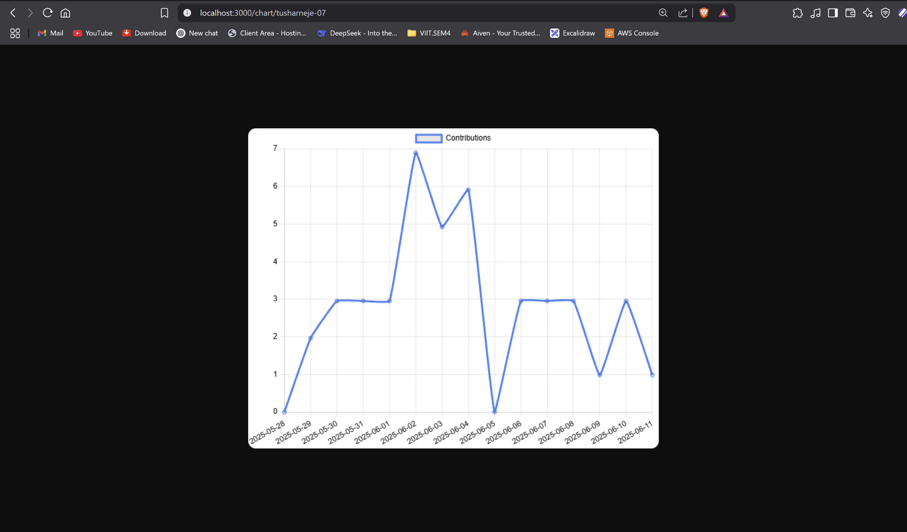

# 🎮 GitHub Stats

A simple and user-friendly react app that show's a Graph of GitHub Contributions


## 🧰 Tech Stack

- HTML5
- TailwindCSS 3
- JavaScript (React)

## 📦 Features

- Show's GitHub Contribution Graph of Last 15-30 Days

## 📸 Screenshot




## 🚀 Getting Started

### 1. Clone the repository

```bash
git clone https://github.com/tusharneje-07/Simple-React-Projects.git
cd GitHub-Stats
cd github-stats
````

### 2. Install Packages
```npm
npm i
```
or
```npm
npm install
```
### 3. Run Server
```npm
npm run dev
```

