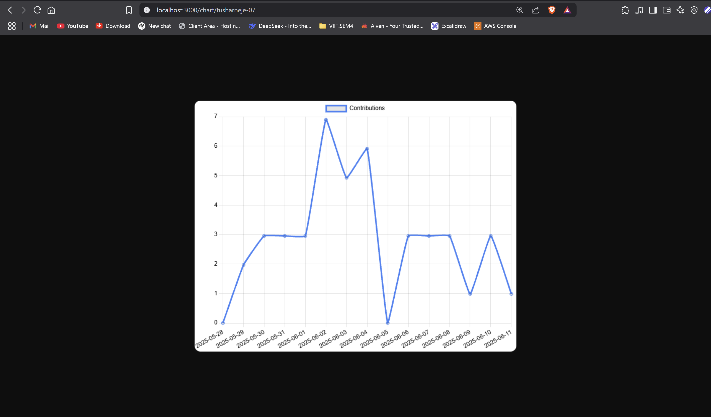

# 🎮 GitHub Stats

A simple and user-friendly React app that displays a graph of GitHub contributions.

## 🧰 Tech Stack

* HTML5
* TailwindCSS 3
* JavaScript (React)

## 📦 Features

* Displays GitHub Contribution Graph for the last 15-30 days.

## 📸 Screenshot




# 🌐 API (Image URL)

You can also use the API to directly get the contribution graph image, which can be embedded in an `img` tag via the `src` attribute.

## 🚀 Getting Started

### Clone the repository

```bash
git clone https://github.com/tusharneje-07/Simple-React-Projects.git
cd GitHub-Stats/api-github-stats
```
```bash
cd api-github-stats
npm install
npm start
```

### Usage

After running the server, you can get the contribution chart image at:

```
http://localhost:3000/chart/<github-username>
```

Replace `<github-username>` with the actual GitHub username.


