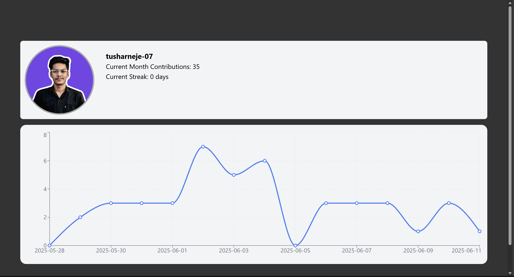

# 🎮 GitHub Stats

A simple and user-friendly React app that displays a graph of GitHub contributions.

## 🧰 Tech Stack

* HTML5
* TailwindCSS 3
* JavaScript (React)

## 📦 Features

* Displays GitHub Contribution Graph for the last 15-30 days.

## 📸 Screenshot




## 🚀 Getting Started

### 1️⃣ Clone the repository

```bash
git clone https://github.com/tusharneje-07/Simple-React-Projects.git
cd GitHub-Stats/github-stats
```

### 2️⃣ Install Packages

Using npm:

```bash
npm install
```

### 3️⃣ Run the Development Server

```bash
npm run dev
```