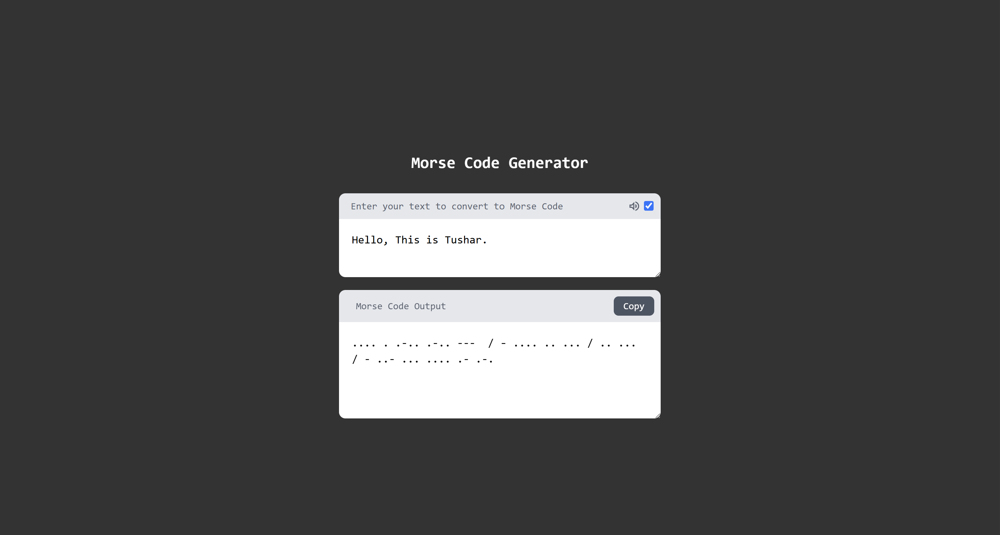

# ⌛ Age Calculator

A simple and user-friendly react appliication for calculating current age by taking Date of Birth and Time of Birth and Updates on each second.


## 🧰 Tech Stack

- HTML5
- TailwindCSS 3
- JavaScript (React)

## 📦 Features

- Show's Current Age by taking DOB and Time.

## 📸 Screenshot




## 🚀 Getting Started

### 1. Clone the repository

```bash
git clone https://github.com/tusharneje-07/Simple-React-Projects.git
cd Age Calculator
cd age-calculator
````

### 2. Install Packages
```npm
npm i
```
or
```npm
npm install
```
### 3. Run Server
```npm
npm run dev
```

