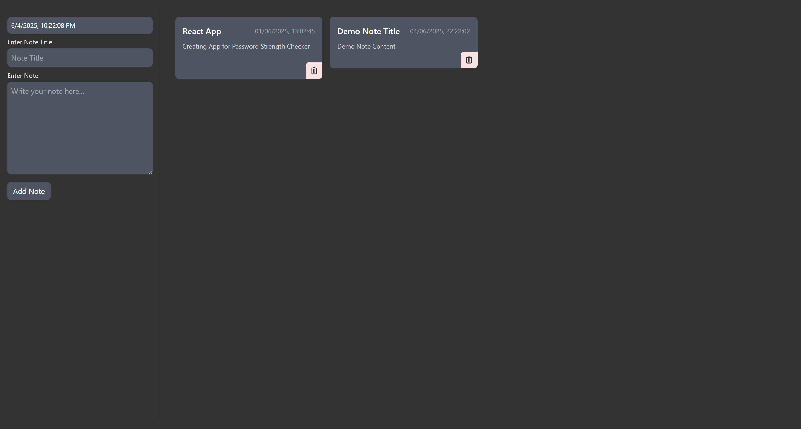

# ⌛ Notes Taking App

A simple and user-friendly react application for taking Notes OR To Do List.


## 🧰 Tech Stack

- HTML5
- TailwindCSS 3
- JavaScript (React)

## 📦 Features

- Take's User Input for Note Title and Note Content.
- Add Notes to Display Area
- Store Notes in LocalStorage
- Delete Note from The Display Area and LocalStorage

## 📸 Screenshot




## 🚀 Getting Started

### 1. Clone the repository

```bash
git clone https://github.com/tusharneje-07/Simple-React-Projects.git
cd Notes Taking App
cd Notes_App
````

### 2. Install Packages
```npm
npm i
```
or
```npm
npm install
```
### 3. Run Server
```npm
npm run dev
```

