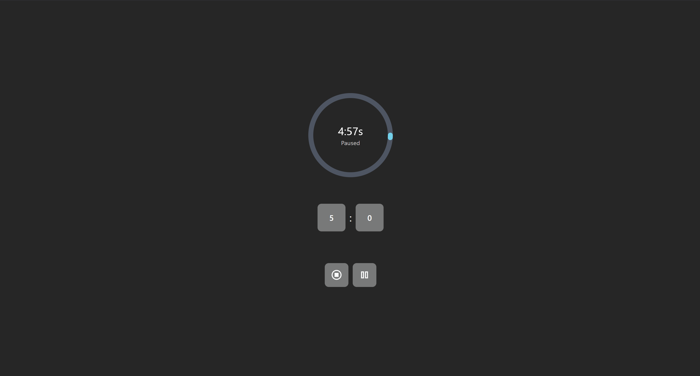

# ⌛ Pmodoro Timer / Custome Timer

A simple and user-friendly react application for Timer.


## 🧰 Tech Stack

- HTML5
- TailwindCSS 3
- JavaScript (React)

## 📦 Features

- Takes Input from User for Minutes and Seconds
- Functions of Pause and Continue Timer

## 📸 Screenshot




## 🚀 Getting Started

### 1. Clone the repository

```bash
git clone https://github.com/tusharneje-07/Simple-React-Projects.git
cd Pomodoro Timer
cd Pomodoro_Timer
````

### 2. Install Packages
```npm
npm i
```
or
```npm
npm install
```
### 3. Run Server
```npm
npm run dev
```

