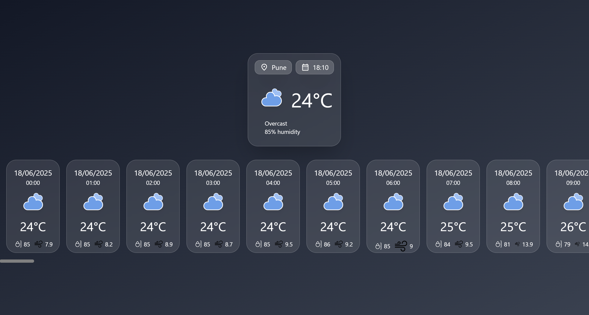

# 🎮 Rock Paper Scissor Game

A simple and user-friendly react weather application


## 🧰 Tech Stack

- HTML5
- TailwindCSS 3
- JavaScript (React)

## 📦 Features

- Display's Weather
- Uses Open Metro's API


## 🌐 API Use
- `https://api.open-meteo.com/v1/forecast?latitude=18.51957&longitude=73.85535&current_weather=true&hourly=relativehumidity_2m,weathercode,temperature_2m,winddirection_10m,wind_speed_10m&timezone=Asia%2FKolkata`

- Open Metro Weather API [`https://open-meteo.com/`](https://open-meteo.com/)

## 📸 Screenshot




## 🚀 Getting Started

### 1. Clone the repository

```bash
git clone https://github.com/tusharneje-07/Simple-React-Projects.git
cd Weather-App
cd weather-app
````

### 2. Install Packages
```npm
npm i
```
or
```npm
npm install
```
### 3. Run Server
```npm
npm run dev
```

